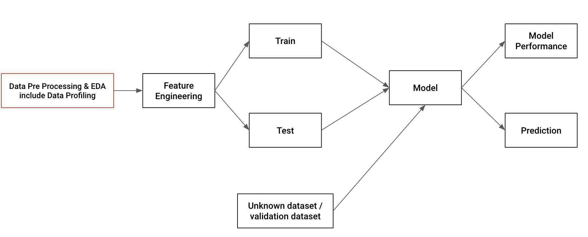

# Data Quality

Exploratory Data Analysis (EDA) adalah menggunakan pendekatan statistik yang bertujuan untuk menemukan dan meringkas sebuah dataset, mengetahui struktur dan hubungan antar variabel dalam dataset. EDA merupakan proses pre-analysis baik untuk descriptive analysis maupun predictive analysis.

Data profiling adalah kegiatan merangkum dataset menggunakan statistik deskriptif. Tujuan dari pembuatan data profiling adalah untuk memiliki pemahaman yang kuat tentang data sehingga dapat mulai menyusun framework analisis  dan memvisualisasikan data.



Bahasan yang ada di course ini adalah

1. Descriptive Statistics
```
len(retail_raw['city']
retail_raw['quantity'].min()
retail_raw['quantity'].max()
retail_raw['quantity'].mean()
retail_raw['quantity'].mode()
retail_raw['quantity'].median()
retail_raw['quantity'].std()
retail_raw['quantity'].quantile([0.25, 0.5, 0.75])
retail_raw[['quantity', 'item_price']].corr()
```
2. Missing Values
```
retail_raw.isnull().any()
```

3. Handle Missing Values
```
retail_raw['quantity'].fillna(retail_raw['quantity'].mean())
retail_raw['quantity'].dropna()
```

4. Detect Outlier
```
Q1 = retail_raw['quantity'].quantile(0.25)
Q3 = retail_raw['quantity'].quantile(0.75)
IQR = Q3 - Q1
```

5. Remove Outlier
```
# Removing outliers
retail_raw = retail_raw[~((retail_raw['quantity'] < (Q1 - 1.5 * IQR)) | (retail_raw['quantity'] > (Q3 + 1.5 * IQR)))]
```

6. Remove Duplicate Values
```
retail_raw.drop_duplicates(inplace=True)
```

## SOURCE : 
https://academy.dqlab.id/